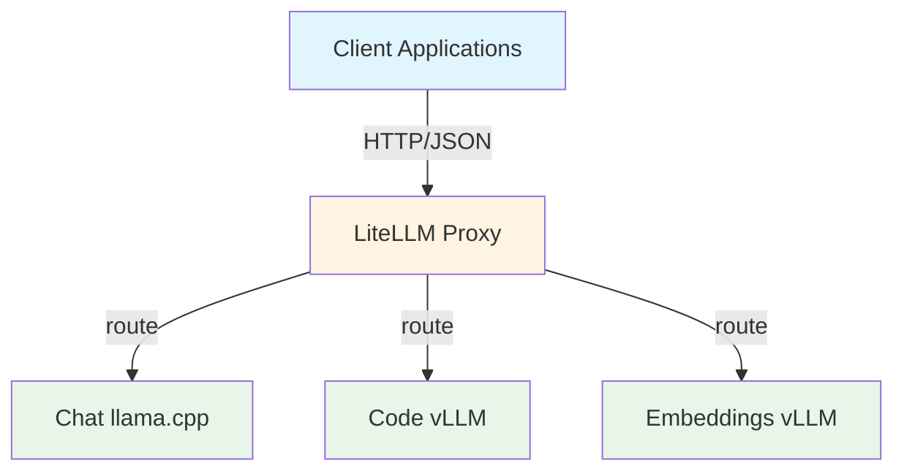
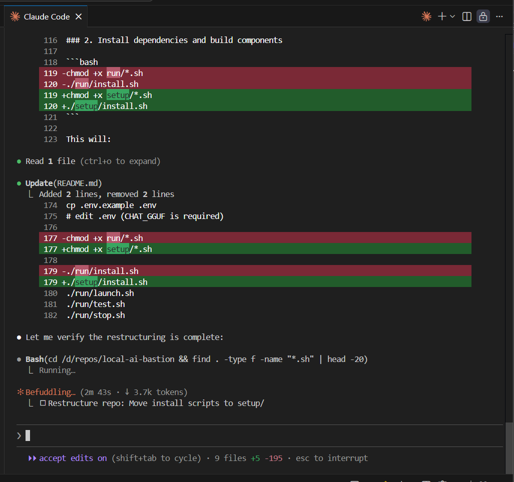
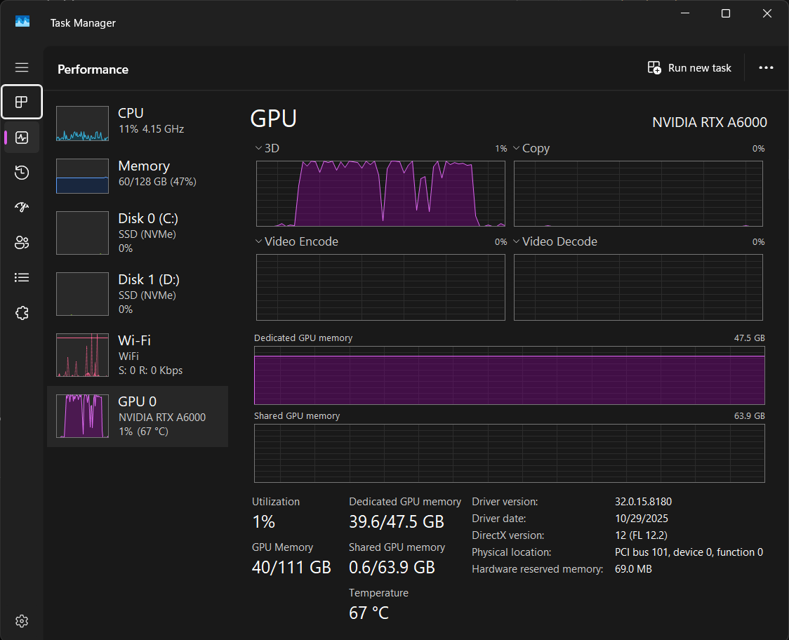

# Local AI Bastion

A fully local AI bastion that runs multiple AI models simultaneously on a single GPU. Features **strict GPU memory budgeting** to prevent VRAM thrash and out-of-memory errors.

Run a complete local AI infrastructure:

* **Chat** via `llama.cpp` (`llama-server`)
  → OpenAI-compatible API at `http://localhost:8001/v1`
  → Also usable directly as a conversational endpoint (fast, private) via `http://localhost:8001`

* **Code + Embeddings** via **vLLM**

* **Single front door** via **LiteLLM proxy**
  → OpenAI-compatible API at `http://localhost:4000/v1` and a Swagger documetnation at `http://localhost:4000` (see [LiteLLM](https://www.litellm.ai/))

The bastion is designed to work **offline** with **local models only**, and integrates cleanly with **Claude Code** (CLI + VS Code) and, potantially, any other tools or AI CLIs relying on OpenAI compatible endpoints.

---

## Features

- **Unified API**: Single OpenAI-compatible endpoint via LiteLLM
- **Multiple Model Types**:
  - Chat: `llama.cpp` (GGUF format) - fast, efficient
  - Code: vLLM (HuggingFace/AWQ quantization) - high performance
  - Embeddings: vLLM (HuggingFace) - vector embeddings
- **GPU Memory Control**: Explicit GPU utilization caps per service
- **Concurrent Serving**: Run all models simultaneously without OOM
- **Fail Fast**: Clear error messages for misconfiguration
- **Simple Management**: One-command start/stop/status

---

## Architecture



### Component Roles

| Component | Technology | Model Format | Port |
|-----------|------------|--------------|------|
| **Front Door** | LiteLLM Proxy | OpenAI-compatible | 4000 |
| **Chat** | llama.cpp (llama-server) | GGUF | 8001 |
| **Code** | vLLM | HuggingFace/AWQ | 8002 |
| **Embeddings** | vLLM | HuggingFace | 8003 |

---

## Prerequisites

### Hardware Requirements

- **GPU**: NVIDIA GPU with... as much VRAM as you can (tested on RTX A6000, 48GB+ VRAM)
- **RAM**: 32GB+ (16GB for models + system overhead)
- **Storage**: 40GB+ free space for models

### Software Requirements

- **OS**: Ubuntu 22.04+ or Windows 11 with WSL2 (Ubuntu)
- **Python**: 3.10+
- **CUDA**: 12.0+ (required for GPU backends)
- **Git**: For cloning the repository

### GPU Drivers

NVIDIA drivers must be installed on Windows (WSL2) or bare-metal Ubuntu.

```bash
# Verify CUDA availability
nvcc --version  # Should show CUDA 12.0+
nvidia-smi       # Should show GPU details and VRAM
```

---

## Installation

### Step 1: Configure Environment

```bash
cp .env.example .env
```

Edit `.env` with your settings:

**Required:**
- `CHAT_GGUF` - Path to your GGUF chat model file

**Optional - Model Directory:**
- `MODEL_DIR` - Root directory for all models (default: `$HOME/models`)

**Optional - Ports:**
- `LITELLM_PORT=4000` - Main API port
- `CHAT_PORT=8001` - Chat service port
- `CODE_PORT=8002` - Code service port
- `EMBED_PORT=8003` - Embeddings service port

**Optional - VRAM Budget:**
- `CODE_GPU_UTIL` - GPU utilization cap for code model (0.32 = 32%)
- `EMBED_GPU_UTIL` - GPU utilization cap for embeddings model (0.06 = 6%)

### Step 2: Install CUDA (if needed)

#### Windows + WSL2

```bash
./setup/install-cuda-wsl.sh
```

* Installs **CUDA Toolkit only** (no drivers)
* NVIDIA drivers must be installed on Windows
* Does not modify shell configuration

#### Ubuntu Bare-Metal

```bash
./setup/install-cuda-ubuntu.sh
```

* Installs **NVIDIA driver + CUDA Toolkit**
* May require system reboot

### Step 3: Install Dependencies

```bash
chmod +x setup/*.sh
./setup/install.sh
```

This creates:
- Python virtual environment at `${VENV_DIR}` (default: `$HOME/venvs/local-ai-bastion`)
- Builds `llama.cpp` with CUDA support
- Installs pinned Python dependencies

---

## Getting Started

### Quick Start

```bash
# From the repository root
cd ~/dev/local-ai-bastion

# Configure environment
cp .env.example .env
# Edit .env (CHAT_GGUF is required)

# Install dependencies
chmod +x setup/*.sh
./setup/install.sh

# Start all services
./run/launch.sh

# Test the setup
./run/test.sh

# Stop when done
./run/stop.sh
```

### Service Management

| Command | Description |
|---------|-------------|
| `./run/launch.sh` | Start all services (code → embed → chat → router) |
| `./run/stop.sh` | Stop all services |
| `./run/stop.sh <name>` | Stop specific service (router/chat/embed/code) |
| `./run/status.sh` | Check running services |
| `./run/test.sh` | Run health checks through the API |

### Testing the API

Once services are running, test via cURL:

```bash
# List available models
curl http://localhost:4000/v1/models

# Chat with the model
curl http://localhost:4000/v1/chat/completions \
  -H "Content-Type: application/json" \
  -d '{
    "model": "chat-glm47",
    "messages": [{"role": "user", "content": "Hello!"}],
    "max_tokens": 100
  }'

# Get embeddings
curl http://localhost:4000/v1/embeddings \
  -H "Content-Type: application/json" \
  -d '{"model": "embed-bge-small", "input": ["hello world"]}'
```

---

## Configuration Reference

### Environment Variables

| Variable | Default | Description |
|----------|---------|-------------|
| `HOST` | 0.0.0.0 | Bind address |
| `VENV_DIR` | `~/venvs/local-ai-bastion` | Python virtual environment path |
| `MODEL_DIR` | `~/models` | Root directory for model files |
| `CHAT_GGUF` | Required | Path to GGUF chat model file |
| `CHAT_MODEL_NAME` | chat-glm47 | Model name exposed at API |
| `CODE_MODEL_NAME` | code-qwen25-14b | Code model name exposed at API |
| `EMBED_MODEL_NAME` | embed-bge-small | Embeddings model name exposed at API |

### VRAM Budgeting

The system uses explicit GPU utilization caps to prevent memory thrash:

| Service | Model | GPU Util | Estimated VRAM |
|---------|-------|----------|----------------|
| CODE | Qwen2.5-Coder-14B-AWQ | 0.32 | ~15.4 GB |
| EMBED | bge-small | 0.06 | ~2.9 GB |
| CHAT | GLM-4.7-Flash GGUF | Remaining | ~29 GB |

### Adjusting for Your GPU

If you hit Out-Of-Memory errors, try in order:

1. Reduce `CODE_MAX_NUM_SEQS` from `6` to `4`
2. Reduce `CHAT_PARALLEL` from `2` to `1`
3. Reduce context length: `CODE_CTX=8192 → 6144`
4. Reduce `CODE_GPU_UTIL`: `0.32 → 0.28`

---

## Logs & Monitoring

All services log to the `logs/` directory:

| Log File | Component | Description |
|----------|-----------|-------------|
| `logs/router.log` | LiteLLM Proxy | API routing logs |
| `logs/chat.log` | llama.cpp | Chat service logs |
| `logs/code.log` | vLLM | Code service logs |
| `logs/embed.log` | vLLM | Embeddings service logs |

### Checking Service Status

```bash
./run/status.sh
```

Output shows which services are running and their PIDs.

---

## Troubleshooting

### Common Issues

**"llama-server not found"**
- Run `./setup/install.sh` to build llama.cpp

**"CUDA not found"**
- Verify CUDA installation: `nvcc --version`
- Re-run `./setup/install-cuda-wsl.sh` or `./setup/install-cuda-ubuntu.sh`

**"Port already in use"**
- Check if another service is running: `lsof -i :8001`
- Stop services: `./run/stop.sh`

**"Out of memory"**
- Reduce GPU utilization caps in `.env`
- Reduce context lengths
- Check GPU is detected: `nvidia-smi`

**"Permission denied" on scripts**
- Make scripts executable: `chmod +x setup/*.sh run/*.sh`

### Debug Mode

Check service logs for errors:

```bash
tail -f logs/chat.log
tail -f logs/code.log
tail -f logs/embed.log
tail -f logs/router.log
```

### Reset Everything

```bash
./run/stop.sh
rm -rf ~/.venvs/local-ai-bastion
rm -rf .deps
./setup/install.sh
./run/launch.sh
```

---

## Project Structure

```
local-ai-bastion/
├── setup/                    # Installation scripts
│   ├── install.sh           # Main installation
│   ├── install-cuda-ubuntu.sh
│   ├── install-cuda-wsl.sh
│   └── install-claude.sh    # Claude Code setup
├── run/                      # Runtime scripts
│   ├── launch.sh            # Start all services
│   ├── stop.sh              # Stop all services
│   ├── status.sh            # Check running services
│   ├── test.sh              # Run health checks
│   ├── router.sh            # Start LiteLLM router
│   ├── code.sh              # Start vLLM code server
│   ├── embed.sh             # Start vLLM embeddings server
│   ├── chat.sh              # Start llama.cpp chat server
│   └── common.sh            # Shared helper functions
├── bin/                      # Compiled binaries
│   └── llama-server         # llama.cpp server (built)
├── logs/                     # Service logs
├── .deps/                    # Dependencies
│   └── llama.cpp/           # llama.cpp source
├── litellm/
│   └── config.template.yaml # LiteLLM router config
├── .env.example              # Environment template
├── requirements.txt          # Python dependencies
├── constraints.txt           # Pinned dependency versions
└── README.md
```

---

## Design Principles

- **Explicit Resource Caps**: No "best effort" allocation
- **No Hidden Defaults**: Critical versions are always pinned
- **One Front Door**: Single API for all models
- **Fail Fast**: Clear errors for misconfiguration
- **Separation of Concerns**: Setup vs runtime in separate folders

---

## Model Recommendations

### Chat (GGUF)
- **GLM-4.7-Flash** - Fast, good balance
- **Llama-3-8B-Instruct** - Lightweight, efficient
- **Mistral-7B-Instruct-v0.2** - Strong reasoning

### Code (HF/AWQ)
- **Qwen2.5-Coder-14B-AWQ** - Best performance
- **DeepSeek-Coder-V2-Lite-Instruct** - Lightweight code
- **CodeLlama-34B-Instruct** - Large context

### Embeddings (HF)
- **bge-small-en-v1.5** - Small, fast, good quality
- **all-MiniLM-L6-v2** - Very small, decent quality
- **text-embedding-3-small** - OpenAI compatible

---

## Claude Code Integration

Configure Claude Code to use the local bastion. **Claude Code only needs ONE thing**:

### Linux (zsh/bash)

```bash
export ANTHROPIC_BASE_URL=http://localhost:4000
```

**What this does:**
- Redirects all Anthropic API traffic to your local LiteLLM proxy
- Claude thinks it's talking to Anthropic, but actually connects to your local models
- Model aliasing (e.g., `code-qwen25-14b` → actual model) is handled by LiteLLM

### Windows (PowerShell)

```powershell
setx ANTHROPIC_BASE_URL http://localhost:4000
```

### No other variables needed

- ✅ `ANTHROPIC_BASE_URL` = **Required** (single env var)
- ❌ `OPENAI_API_KEY` = Not needed (not using OpenAI)
- ❌ `ANTHROPIC_API_KEY` = Not needed (not using cloud Anthropic)
- ❌ `OPENAI_BASE_URL` = Optional (only for OpenAI-compatible tools)

### Claude Code Working On Its Own

Claude Code can independently use the Local AI Bastion to perform complex development tasks on your behalf.




Here you can see the tipical GPU spike... 


---

## Final notes

This project is provided as-is for educational and personal use.
